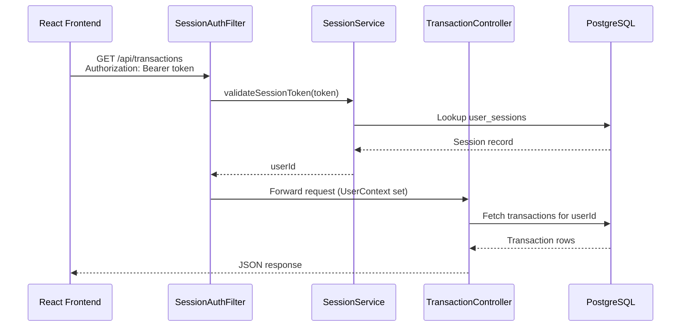
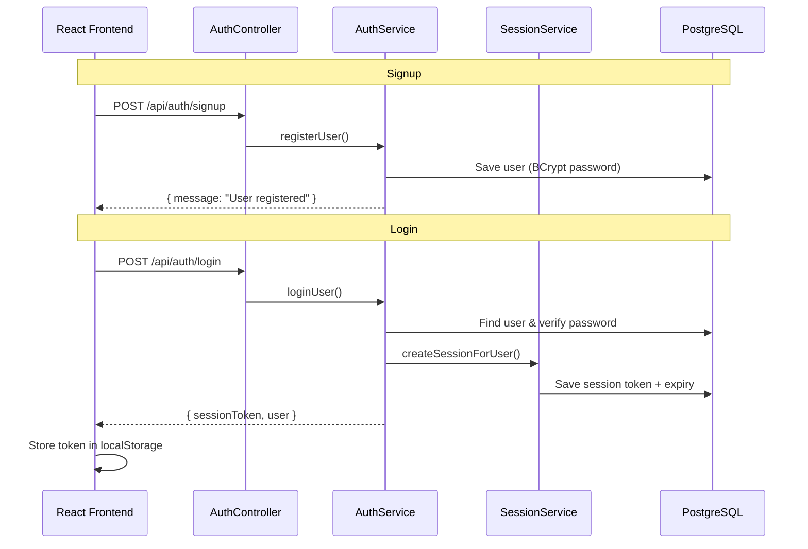

# Finance Tracker

A full-stack personal finance application for tracking income and expenses. Users can sign up, log in, and manage their transactions from a React dashboard backed by a Spring Boot API and PostgreSQL database.

## Tech Stack

| Layer | Technology |
|-------|------------|
| **Frontend** | React 19, TypeScript, Vite, React Router |
| **Backend** | Java 21, Spring Boot 3.4, Spring Security, Spring Data JPA |
| **Database** | PostgreSQL 16 |
| **Auth** | Bearer session tokens (stored in DB, validated per request) |

## Project Structure

```
Finance-Tracker/
├── backend/                    # Spring Boot REST API
│   ├── docker-compose.yml      # PostgreSQL container
│   ├── pom.xml
│   └── src/
│       ├── main/java/com/financetracker/
│       │   ├── config/         # Security, CORS, app properties
│       │   ├── controller/     # Auth & transaction endpoints
│       │   ├── dto/            # Request/response models
│       │   ├── entity/         # JPA entities (User, Transaction, UserSession)
│       │   ├── repository/     # Data access
│       │   ├── security/       # Session filter & user context
│       │   └── service/        # Business logic
│       └── test/               # Unit & integration tests
│
└── frontend/                   # React + TypeScript SPA
    ├── src/
    │   ├── api/                # HTTP client, auth & transaction calls
    │   ├── components/         # Reusable UI components
    │   ├── pages/              # Login and dashboard pages
    │   ├── styles/             # CSS
    │   ├── types/              # TypeScript interfaces
    │   └── utils/              # Session token helpers
    ├── package.json
    └── vite.config.ts
```

## Prerequisites

- **Java 21**
- **Maven 3.9+**
- **Node.js 18+** and **npm**
- **Docker** (for PostgreSQL)

## Getting Started

### 1. Start the database

```bash
cd backend
docker compose up -d
```

This starts PostgreSQL on port `5432` with:

| Setting | Value |
|---------|-------|
| Database | `finance_tracker` |
| User | `finance_user` |
| Password | `finance_pass` |

### 2. Start the backend

```bash
cd backend
mvn spring-boot:run
```

The API runs at **http://localhost:8080**.

Verify it is up:

```bash
curl http://localhost:8080/
# Backend running
```

### 3. Start the frontend

```bash
cd frontend
npm install
cp .env.example .env   # optional — defaults to http://localhost:8080/api
npm start
```

The app opens at **http://localhost:5173**.

### 4. Run tests (backend)

```bash
cd backend
mvn test
```

### 5. Production build (frontend)

```bash
cd frontend
npm run build
```

Output is written to `frontend/dist/`. Set `VITE_API_URL` to your deployed API URL before building.

## Environment Variables

### Frontend (`frontend/.env`)

| Variable | Default | Description |
|----------|---------|-------------|
| `VITE_API_URL` | `http://localhost:8080/api` | Backend API base URL |

### Backend (`backend/src/main/resources/application.yml`)

| Setting | Default | Description |
|---------|---------|-------------|
| `server.port` | `8080` | API port |
| `spring.datasource.*` | see `application.yml` | PostgreSQL connection |
| `app.session.expiry-hours` | `168` | Session lifetime (7 days) |
| `app.cors.allowed-origins` | localhost + Vercel | Allowed frontend origins |

## API Endpoints

Base path: `/api`

### Auth (public)

| Method | Path | Description |
|--------|------|-------------|
| `POST` | `/auth/signup` | Register a new user |
| `POST` | `/auth/login` | Log in and receive a session token |
| `POST` | `/auth/logout` | Invalidate session (requires token) |

### Transactions (protected — requires `Authorization: Bearer <token>`)

| Method | Path | Description |
|--------|------|-------------|
| `GET` | `/transactions` | List all transactions for the logged-in user |
| `POST` | `/transactions` | Create a transaction |
| `PUT` | `/transactions/{id}` | Update a transaction |
| `DELETE` | `/transactions/{id}` | Delete a transaction |

### Example: Login

```bash
curl -X POST http://localhost:8080/api/auth/login \
  -H "Content-Type: application/json" \
  -d '{"email":"user@example.com","password":"secret123"}'
```

Response:

```json
{
  "sessionToken": "abc123...",
  "user": { "id": 1, "name": "John", "email": "user@example.com" }
}
```

### Example: Create transaction

```bash
curl -X POST http://localhost:8080/api/transactions \
  -H "Content-Type: application/json" \
  -H "Authorization: Bearer <sessionToken>" \
  -d '{
    "amount": 500,
    "type": "expense",
    "category": "Food",
    "description": "Lunch",
    "date": "2026-06-27"
  }'
```

## Authentication

- On login, the backend creates a **session token** and stores it in the `user_sessions` table.
- The frontend saves the token in `localStorage` and sends it as a `Bearer` token on every protected request.
- `SessionAuthFilter` validates the token on each request (except `/`, signup, and login).
- Expired or invalid tokens return **401 Unauthorized**; the frontend clears the session and redirects to login.
- Passwords are hashed with **BCrypt** before storage.

## Application Flow

### High-level architecture


### User journey


### Request flow (protected endpoint)



### Signup & login flow



## What Not to Commit

These are already listed in `.gitignore`:

- `node_modules/`, `frontend/dist/`
- `backend/target/`
- `.env` files (use `.env.example` as a template)
- IDE and OS files (`.idea/`, `.DS_Store`)

## License

Private project — all rights reserved.
