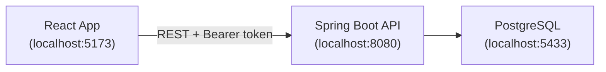
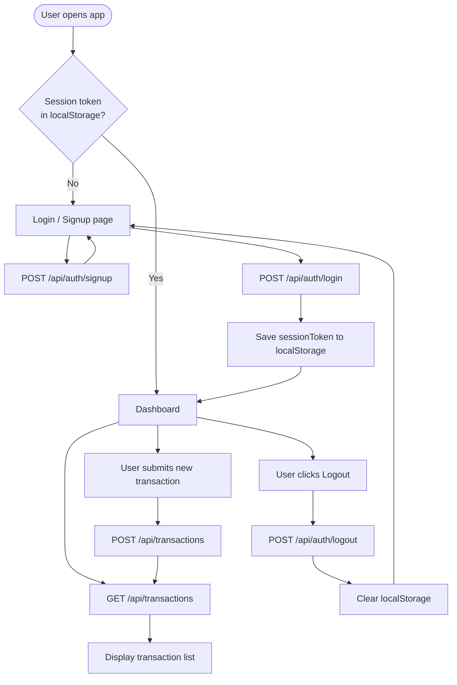
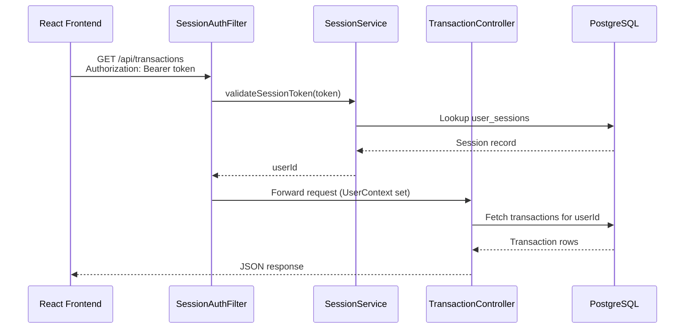
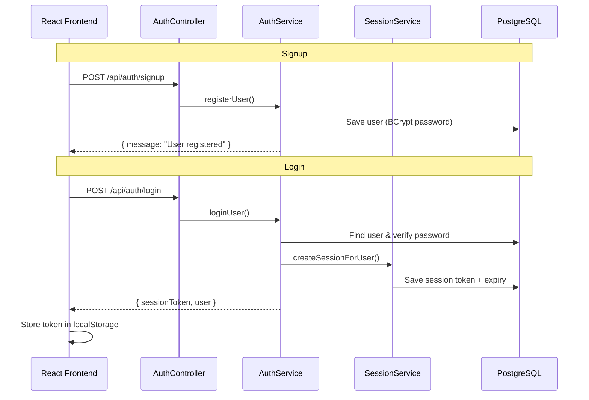
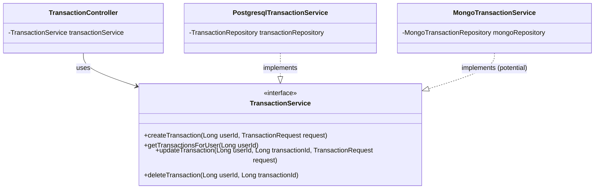

# Finance Tracker

A full-stack personal finance application for tracking income and expenses. Users can sign up, log in, and manage their transactions from a React dashboard backed by a Spring Boot API and PostgreSQL database.

## Deployed Application Links

- **Frontend App (Vercel)**: [https://frontend-green-two-50.vercel.app/](https://frontend-green-two-50.vercel.app/)
- **Backend API (Render)**: [https://finance-tracker-dacv.onrender.com](https://finance-tracker-dacv.onrender.com/)
- **Production Database (Neon)**: Connected via cloud pooler host

## Tech Stack

| Layer | Technology |
|-------|------------|
| **Frontend** | React 19, TypeScript, Vite, React Router |
| **Backend** | Java 21, Spring Boot 3.4, Spring Security, Spring Data JPA |
| **Database** | PostgreSQL 16 (Local native instance or hosted on Neon Cloud) |
| **Auth** | Bearer session tokens (stored in DB, validated per request) |

## Project Structure

```
Finance-Tracker/
├── backend/                    # Spring Boot REST API
│   ├── pom.xml
│   └── src/
│       ├── main/java/com/financetracker/
│       │   ├── config/         # Security, CORS, app properties
│       │   ├── controller/     # Auth & transaction endpoints
│       │   ├── dto/            # Request/response models
│       │   ├── entity/         # JPA entities (User, Transaction, UserSession)
│       │   ├── repository/     # Data access
│       │   ├── security/       # Session filter & user context
│       │   └── service/        # Business logic
│       └── test/               # Unit & integration tests
│
└── frontend/                   # React + TypeScript SPA
    ├── src/
    │   ├── api/                # HTTP client, auth & transaction calls
    │   ├── components/         # Reusable UI components
    │   ├── pages/              # Login and dashboard pages
    │   ├── styles/             # CSS
    │   ├── types/              # TypeScript interfaces
    │   └── utils/              # Session token helpers
    ├── package.json
    └── vite.config.ts
```

## Prerequisites

- **Java 21**
- **Maven 3.9+**
- **Node.js 18+** and **npm**
- **PostgreSQL 16+** (locally installed or external instance)

## Getting Started

### 1. Configure and Start the database

Ensure you have a PostgreSQL server running locally or externally. You should create a database and a user with access to it.

For local development, you can use the default connection values or set environment variables:

| Setting | Env Var | Default |
|---------|---------|---------|
| Database | `DB_NAME` | `finance_tracker` |
| User | `DB_USER` | `finance_user` |
| Password | `DB_PASSWORD` | `finance_pass` |
| Host | `DB_HOST` | `localhost` |
| Port | `DB_PORT` | `5432` |

Create the database `finance_tracker` on your PostgreSQL instance:
```sql
CREATE DATABASE finance_tracker;
CREATE USER finance_user WITH PASSWORD 'finance_pass';
GRANT ALL PRIVILEGES ON DATABASE finance_tracker TO finance_user;
```

### 2. Start the backend

```bash
cd backend
mvn spring-boot:run
```

The API runs at **http://localhost:8080**.

Verify it is up:

```bash
curl http://localhost:8080/
# Backend running
```

### 3. Start the frontend

```bash
cd frontend
npm install
cp .env.example .env   # optional — defaults to http://localhost:8080/api
npm start
```

The app opens at **http://localhost:5173**.

### 4. Run tests (backend)

```bash
cd backend
mvn test
```

### 5. Production build (frontend)

```bash
cd frontend
npm run build
```

Output is written to `frontend/dist/`. Set `VITE_API_URL` to your deployed API URL before building.

## Environment Variables

### Frontend (`frontend/.env`)

| Variable | Default | Description |
|----------|---------|-------------|
| `VITE_API_URL` | `http://localhost:8080/api` | Backend API base URL |

### Backend (Render env vars or `application.yml`)

| Setting | Env var | Default | Description |
|---------|---------|---------|-------------|
| Server port | `PORT` | `8080` | Set automatically by Render |
| DB host | `DB_HOST` | `localhost` | PostgreSQL host |
| DB port | `DB_PORT` | `5432` | PostgreSQL port |
| DB name | `DB_NAME` | `finance_tracker` | Database name |
| DB user | `DB_USER` | `finance_user` | Database user |
| DB password | `DB_PASSWORD` | `finance_pass` | Database password |
| Session expiry | `SESSION_EXPIRY_HOURS` | `16` | Session lifetime (hours) |
| CORS origins | `APP_CORS_ALLOWED_ORIGINS` | `http://localhost:5173,...` | Comma-separated frontend URLs |

## Deployment

### Backend on Render

The repo includes a [`render.yaml`](render.yaml) blueprint and [`backend/Dockerfile`](backend/Dockerfile).

#### Option A — Blueprint (recommended)

1. Push this repo to GitHub.
2. Go to [Render Dashboard](https://dashboard.render.com/) → **New** → **Blueprint**.
3. Connect the repo — Render reads `render.yaml` and creates:
   - Web service (`finance-tracker-api`) using Docker
4. After deploy, copy your API URL (e.g. `https://finance-tracker-api.onrender.com`).
5. In the Render web service → **Environment**, configure the following variables (refer to your external/local database details):
   - `DB_HOST` (e.g. your hosted PostgreSQL host)
   - `DB_PORT` (e.g. `5432`)
   - `DB_NAME` (your database name)
   - `DB_USER` (your database user)
   - `DB_PASSWORD` (your database password)
   - `APP_CORS_ALLOWED_ORIGINS` (e.g. `https://your-app.vercel.app,http://localhost:5173`)

#### Option B — Manual setup

1. **New Web Service** on Render → connect repo:
   - **Root Directory:** `backend`
   - **Runtime:** Docker
   - **Health Check Path:** `/`
2. Add environment variables:

   | Key | Value |
   |-----|-------|
   | `DB_HOST` | your external PostgreSQL database host |
   | `DB_PORT` | `5432` |
   | `DB_NAME` | your database name |
   | `DB_USER` | your database user |
   | `DB_PASSWORD` | your database password |
   | `APP_CORS_ALLOWED_ORIGINS` | `https://your-app.vercel.app` |

3. Deploy and copy the service URL.

> **Note:** Render free-tier services spin down after inactivity. The first request after idle may take 30–60 seconds.

---

### Frontend on Vercel

1. Push this repo to GitHub.
2. Go to [Vercel Dashboard](https://vercel.com/) → **Add New Project** → import the repo.
3. Configure the project:

   | Setting | Value |
   |---------|-------|
   | **Root Directory** | `frontend` |
   | **Framework Preset** | Vite |
   | **Build Command** | `npm run build` |
   | **Output Directory** | `dist` |

4. Add environment variable:

   | Key | Value |
   |-----|-------|
   | `VITE_API_URL` | `https://your-app.onrender.com/api` |

5. Deploy and copy your Vercel URL.
6. Update Render `APP_CORS_ALLOWED_ORIGINS` with that Vercel URL → redeploy backend.

[`frontend/vercel.json`](frontend/vercel.json) handles SPA routing so `/dashboard` works on refresh.

### Deployment order

1. Deploy **backend** on Render → get API URL
2. Deploy **frontend** on Vercel with `VITE_API_URL=https://<render-url>/api`
3. Set **`APP_CORS_ALLOWED_ORIGINS`** on Render to your Vercel URL
4. Redeploy backend if CORS was not set initially

## API Endpoints

Base path: `/api`

### Auth (public)

| Method | Path | Description |
|--------|------|-------------|
| `POST` | `/auth/signup` | Register a new user |
| `POST` | `/auth/login` | Log in and receive a session token |
| `POST` | `/auth/logout` | Invalidate session (requires token) |

### Transactions (protected — requires `Authorization: Bearer <token>`)

| Method | Path | Description |
|--------|------|-------------|
| `GET` | `/transactions` | List all transactions for the logged-in user |
| `POST` | `/transactions` | Create a transaction |
| `PUT` | `/transactions/{id}` | Update a transaction |
| `DELETE` | `/transactions/{id}` | Delete a transaction |

### Example: Login

```bash
curl -X POST http://localhost:8080/api/auth/login \
  -H "Content-Type: application/json" \
  -d '{"email":"user@example.com","password":"secret123"}'
```

Response:

```json
{
  "sessionToken": "abc123...",
  "user": { "id": 1, "name": "John", "email": "user@example.com" }
}
```

### Example: Create transaction

```bash
curl -X POST http://localhost:8080/api/transactions \
  -H "Content-Type: application/json" \
  -H "Authorization: Bearer <sessionToken>" \
  -d '{
    "amount": 500,
    "type": "expense",
    "category": "Food",
    "description": "Lunch",
    "date": "2026-06-27"
  }'
```

## Authentication

- On login, the backend creates a **session token** and stores it in the `user_sessions` table.
- The frontend saves the token in `localStorage` and sends it as a `Bearer` token on every protected request.
- `SessionAuthFilter` validates the token on each request (except `/`, signup, and login).
- Expired or invalid tokens return **401 Unauthorized**; the frontend clears the session and redirects to login.
- Passwords are hashed with **BCrypt** before storage.

## Application Flow

### High-level architecture



### User journey



### Request flow (protected endpoint)



### Signup & login flow



## SOLID Architecture & Extension Patterns

This project follows SOLID design principles to ensure maintainability and easy extension.

### 1. SOLID Compliance
- **S (Single Responsibility)**: Each class has a single, well-defined responsibility (Controllers for routing, Services for business rules, Repositories for data).
- **O (Open/Closed)**: The system is open for extension but closed for modification. For example, adding new storage types does not require editing existing controllers.
- **L (Liskov Substitution)**: Any subclass/subtype implementation can substitute its parent interface without altering correctness.
- **I (Interface Segregation)**: Interfaces are lean and client-focused (e.g., `TransactionService` only exposes required business operations).
- **D (Dependency Inversion)**: High-level modules (Controllers) depend on abstractions (Interfaces) rather than concrete implementations (Services).

### 2. Strategy Pattern (Transaction Storage)
We have implemented the **Strategy Pattern** for the transaction storage system. The `TransactionController` serves as the context, communicating with the `TransactionService` interface (the strategy), which is currently implemented by `PostgresqlTransactionService`.



### 3. Adding a New Database (e.g. MongoDB)
To add a new database (like MongoDB) alongside or instead of PostgreSQL:
1. Create a new repository interface extending `MongoRepository`.
2. Write a new class implementing the `TransactionService` interface (e.g., `MongoTransactionService`).
3. Handle bean conflicts using Spring's standard annotations:
   - **`@Qualifier("mongodbService")`**: Explicitly bind to MongoDB.
   - **`@Primary`**: Declare one database as the default fallback.
   - **`@ConditionalOnProperty(name="app.database-type", havingValue="mongo")`**: Swap databases dynamically via `application.yml` (e.g., `app.database-type: mongo`).

### 4. Future Considerations (Factory & Builder Patterns)
- **Factory Pattern**: If you want to dynamically choose the storage engine at runtime based on incoming request parameters or dynamically changing configurations, you can implement a `TransactionServiceFactory` bean that returns the matching `TransactionService` implementation.
- **Builder Pattern**: For complex entities or DTOs with many fields (such as `Transaction` or `User`), you can implement the Builder Pattern (or use Lombok's `@Builder` annotation) to simplify object construction and eliminate long constructor/setter blocks.

- **Pagination Pattern**: As user transaction data grows, returning all records in a single query degrades performance. To scale, implement Spring Data pagination:
  * **Repository**: Change queries to accept a `Pageable` parameter and return a `Page<Transaction>`:
    ```java
    Page<Transaction> findByUserId(Long userId, Pageable pageable);
    ```
  * **Service Interface**: Update signatures to return paginated lists:
    ```java
    Page<TransactionResponse> getTransactionsForUser(Long userId, Pageable pageable);
    ```
  * **Controller**: Accept `page` and `size` parameters with defaults:
    ```java
    @GetMapping
    public ResponseEntity<Page<TransactionResponse>> getTransactions(
            @RequestParam(defaultValue = "0") int page,
            @RequestParam(defaultValue = "10") int size
    ) {
        Pageable pageable = PageRequest.of(page, size, Sort.by("date").descending());
        return ResponseEntity.ok(transactionService.getTransactionsForUser(userId, pageable));
    }
    ```

## What Not to Commit

These are already listed in `.gitignore`:

- `node_modules/`, `frontend/dist/`
- `backend/target/`
- `.env` files (use `.env.example` as a template)
- IDE and OS files (`.idea/`, `.DS_Store`)

## License

Private project — all rights reserved.
